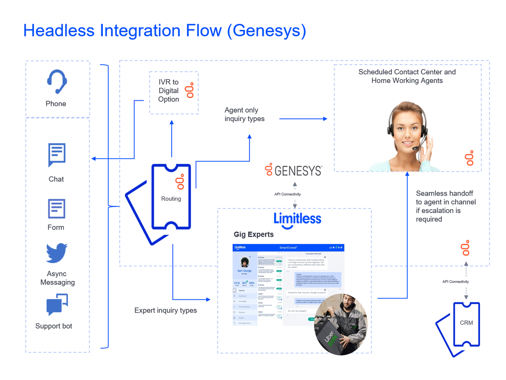

# Limitless Blueprint - Messaging Flow

This Limitless Blueprint provides instructions for integrating Limitless into Genesys Cloud using a Messaging Flow. By using this flow messaging channels in Genesys Cloud can be connected to Limitless APIs, bringing GigCX Experts into the conversation through the Limitless SmartCrowd platform.

The flow performs the following functions:

*   Routing of conversations to Expert Crowd
*   Integration between Genesys Cloud and the Limitless SmartCrowd platform
*   Facilitates the conversation between customer and GigCX Expert
*   Manages the lifecycle/status events coming from the SmartCrowd platform and routes accordingly within Genesys
*   Brings a Genesys Agent into the conversation if the Expert Crowd is unable to help the Customer

A high-level representation of the implementation can be seen in the diagram.

Venkats test changes, please reject

